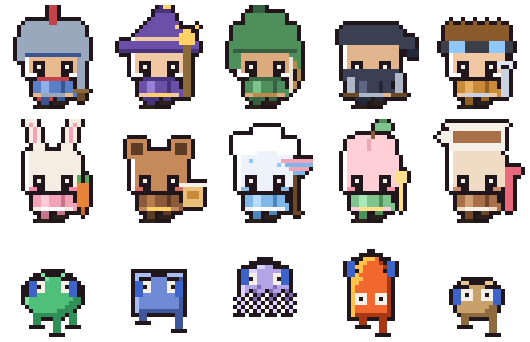
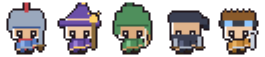
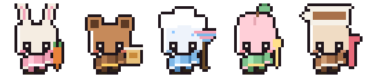
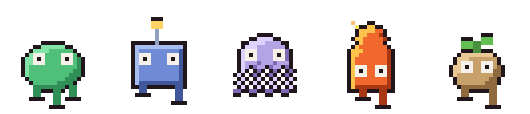
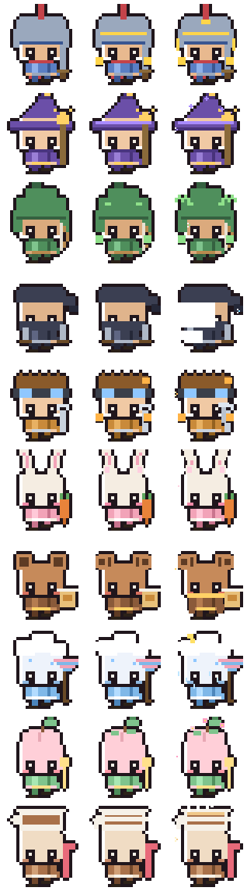
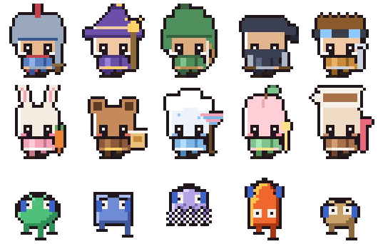

# claude-pet

A desktop pet that shows what your coding agent is doing **right now**.

<p align="center">
  
</p>

It sits in the corner of your screen, reads the session files Claude Code and
Codex already write, and shows the tool being used, the thing it was asked for,
and what the agent just said. When the agent finishes and it's your turn, a red
badge appears.

No hooks to install, no server to run, no configuration. If nothing is running,
nothing shows up.

```bash
npx claude-pet
```

---

## What it reads

Everything on screen comes from files that already exist on your machine:

| Shown | Read from |
|---|---|
| What it's doing now | the last event in the newest session transcript |
| The message | the agent's own text, or your last prompt |
| Skills · plugins · MCP · rules | the capability blocks in the session, and `~/.claude/plugins/installed_plugins.json` |
| Level | tokens spent, counted incrementally as the transcript grows |
| Waiting for you | the agent stopped **after answering** — not after a tool call |

Nothing is invented. An agent that is still working does not get the "your turn"
badge, because it is not your turn.

Reading is incremental: each session file keeps a cursor, and only the bytes
appended since the last poll are parsed. A poll costs about **0.04 ms**, so the
pet can sit there all day without warming your lap.

## Characters

Fifteen characters ship with the app. Pick one by clicking the pet, then choosing
from the row in the panel — the choice is remembered.

**Heroes** — Rook (knight, sword) · Vela (mage, staff) · Fenn (ranger, bow) ·
Nyx (rogue, daggers) · Pip (tinker, wrench)



**Friends** — Bunbun (rabbit, carrot) · Choco (bear, honey) · Nimbus (cloud,
umbrella) · Momo (peach, spoon) · Mocha (coffee cup, straw)



**Creatures** — Blip (slime) · Cog (robot) · Wisp (ghost) · Ember (flame) ·
Sprout (seed)



Each sheet has nine rows, and the row is chosen by what the agent is actually
doing:

| Row | When |
|---|---|
| Idle / waiting | it's your turn, or nothing is running |
| Thinking | between your prompt and the first tool call |
| Searching | `Read` `Grep` `Glob` `WebSearch` `WebFetch` |
| Running | `Bash` and friends |
| Fixing | `Edit` `Write`, and everything else |
| Answering | writing the reply |

<p align="center">
  
  <br><sub>waiting → thinking → searching → running → fixing → answering</sub>
</p>

### Evolution

Levels that don't change anything are just a number. Characters grow with yours:

| Stage | From | What changes |
|---|---|---|
| 1 | Lv.1 | the base character |
| 2 | Lv.15 | gold trim, shoulder guards, a scarf — the silhouette widens |
| 3 | Lv.35 | what that character already was, more so |

Nobody gets the same crown. A knight who gets a crown has been promoted; a rabbit
who gets a crown is just a rabbit wearing a crown. So each one grows into itself
— the knight's armour thickens and its plume grows, the mage gains orbiting
stars, the rabbit's ears lengthen, the cloud starts raining, the rogue leaves an
afterimage. Evolution is not becoming something else; it is becoming more of
yourself.

<p align="center">
  
</p>

Nothing is invented here either. Level comes from tokens, tokens are observed, so
the stage is a function of what actually happened. The panel shows the next
threshold — an evolution nobody saw coming is an accident, not a system.

### Sprite packs

The built-in sheets use the same atlas format as
[codex-pets](https://www.npmjs.com/package/codex-pets). Install a pack and it
shows up in the picker next to the built-in cast:

```bash
npx codex-pets add clawd
```

Packs are read in place from `~/.codex/pets/` — nothing is copied into this
repo, so an artist's sheet stays where they published it.

The grid is measured from the sheet itself, not assumed. Cells are 192×208 in
every pack, but the number of rows is not (Clawd has 9, Pepe has 11) — guessing
gets you a character sliced in half.

## Talking

The pet speaks from what it observed, never from a timer. There are two channels,
and separating them is the whole design:

**Muttering** — what it's doing *right now*. Small, quiet, roughly once a minute
while work is happening, gone in seven seconds. Reading, grepping, typing into a
terminal — each tool gets its own line. Missing one costs nothing, which is why
it can be frequent.

**Speaking up** — something *happened*. A proper bubble with a tail, up to a few
times an hour:

| | When |
|---|---|
| Your turn | it finished answering five minutes ago and you haven't come back — shown with the agent's own first sentence, so you can judge whether to |
| Level up | you crossed a threshold |
| Take a break | you've been at it two hours — the one place "rest" is grounded in something |
| New gear | a skill or plugin it hasn't seen before |
| Delegating | subagents are out |
| Still going | one request passed eight minutes |
| Quiet | nothing has run for twelve minutes. That is also an observation |

Three settings: **chatty** (default), **normal** (events only), **quiet**
(nothing). A budget, a floor on the gap between two lines, and a per-kind
cooldown keep it from becoming background noise — and it prefers a different
subject each time, because a pet that makes the same sound is an alert tone.

Nothing is spoken while the window is hidden, and nothing queues up for later.

## Settings

Click the pet, then **⚙**. Choosing a character, tuning how much it talks, and
approving memories are all real screens now — reviewing a list of proposed
memories was never something a bubble that vanishes in twelve seconds could do.

Everything the pet owns lives in `~/.claude-pet/` — `settings.json`,
`HEARTBEAT.md`, `SOUL.md`, and the memory queue. All plain text, all yours to
edit.

**It doesn't leave on its own.** Close the window and it comes back; the renderer
crashes and it reloads; the settings window closes and the pet stays. The only
way out is the quit button — something that lives in the corner of your screen
shouldn't be able to vanish quietly, because you'd notice long after it did.

A heartbeat covers the failure that isn't a crash: a renderer that throws keeps
its window up and its process alive while the panel sits there empty. It reports
in only after a full update completes, so a broken one goes quiet and gets
reloaded.

Surviving a reboot is a separate question, and one we don't answer without being
asked — the login-item toggle is in **상태**, off by default. It reads the setting
back after writing it, so if the OS refuses (unsigned builds do), the switch says
off instead of lying to you.

## Equipment

Without a sprite pack the character is the agent's own mark, and gear is worn
because it is **installed**:

- **Hat** — a plugin is installed. Five to choose from.
- **Weapon** — a skill is installed. Six to choose from, each with its own swing.
- **Toolbox pet** — an MCP server is connected. One pet stands for all of them.

With a sprite character the gear is already drawn into the frames, so the picker
shows characters instead. The counts still live in the panel either way.

## Level

Levels come from tokens, not from quality. We can count how much an agent spent;
we cannot count how well it did, and a number that pretends otherwise is worse
than no number.

The curve is geometric: level 1 at 1,000 tokens, level 100 at 1 trillion, with
each level costing about 23% more than the last. Early levels arrive quickly and
later ones do not — which is the point.

| Level | Tokens |
|---|---|
| 1 | 1,000 |
| 23 | 100,000 |
| 44 | 9,400,000 |
| 60 | 240,000,000 |
| 100 | 1,000,000,000,000 |

The running total is kept per file in `~/.claude-pet/progress.json`, so restarting
doesn't recount and doesn't double count.

*(This directory used to be `~/.kibitz-pet`, from when the pet lived inside
kibitz. It moves itself across on first run — losing someone's level to a rename
would be a poor trade for a tidier name.)*

## Controls

| | |
|---|---|
| Click | pin the panel open |
| Hover | peek at the panel |
| Drag | move the pet |
| Open this session | jump back to that conversation (⌥ for a dashboard) |
| × | hide this pet until the next session |

The window passes clicks through everywhere except the pet itself, so it never
takes over the corner of your screen it happens to be sitting in.

## Art

Every sheet is generated, so the grid, palette and proportions stay consistent
across fifteen characters — nine rows each, 755 frames in all:

```bash
npm run assets
```

| File | Makes |
|---|---|
| `make-heroes.mjs` | the heroes and friends — one humanoid rig, one entry per character |
| `make-pets.mjs` | the creatures — silhouette functions instead of a rig |
| `make-items.mjs` · `make-weapons.mjs` | hats and weapons for the mark-based character |
| `make-readme-art.mjs` | the pictures on this page, cut straight from the sheets |

<p align="center">
  
</p>

Drawn on a 24×26 grid, doubled to 48×52, then scaled 4× — the cell stays 192×208
so packs remain interchangeable, but evolution detail gets four times the pixels.
Drawing straight onto the fine grid would mean rewriting every coordinate; the
coarse shape is upscaled and the detail is added on top. The proportions aren't taste: characters
that stay likeable share a few rules — big head, small body, **eyes low on the
face**, blush above the cheek, no nose or fingers, cut corners. Changing one
constant in the rig moves all nine rows of every character at once.

The pictures above are baked from the same sheets the app loads — including the
GIF encoder, which is 150 lines in `tools/gif.mjs`. A screenshot pasted into a
README goes stale the first time someone changes a character; a generated one
cannot.

No image library. Fixing a sprite shouldn't start with an install.

## Development

```bash
npm start      # run it
npm test       # renderer tests, no browser needed
```

The renderer tests matter more than they look. Electron keeps the window up when
a renderer throws, so "the process is alive" proves nothing — a panel once went
completely blank while `pgrep` said everything was fine.

## Memory

The pet proposes what to remember; you approve — in the **기억** tab, which shows
you exactly which directory each one would be written to before you press the
button. Approved memories are written
where your agent already reads them — `<project>/memory/<name>.md` plus a line in
`MEMORY.md` — so the next session actually loads them. A memory nobody reads is
not a memory.

No vector store, no graph database, no embeddings. Not out of laziness: at this
size (hundreds of facts, one query — "what matters in this project") a list plus
an index beats a nearest-neighbour search, and you can read and edit it yourself.

Four ideas were worth taking from the literature:

| Idea | From | Why |
|---|---|---|
| Validity windows | [Zep](https://arxiv.org/abs/2501.13956) | A fact has a lifetime. Superseded facts are retired, not deleted — *when* it stopped being true is information |
| Usage feedback | [RMM, ACL 2025](https://aclanthology.org/2025.acl-long.413/) | Memories that actually get cited rank higher; unused ones fade (30-day half-life) |
| Promote and reject | memory-lake | Candidate → fact → rule. Rejections are logged **with a reason** — the way automatic extraction fails is not by storing wrong things but by storing anything |
| Links | [A-MEM](https://arxiv.org/abs/2502.12110) | `[[name]]` between notes; new facts update old ones |

The extraction runs on a schedule you write yourself, in plain Korean, in
`~/.claude-pet/HEARTBEAT.md`:

    매일 09:00
    매일 18:00
    켤 때

How often it wakes *is* what it costs (about $0.05 a run), so that decision
doesn't get buried in code. Lines the parser can't read are shown back to you
rather than dropped — a schedule silently ignored is worse than none, because
you'd sit there waiting for it.

It gets no tools and no file access. The pet assembles the input, the agent
returns JSON, the pet validates and writes — so we can say exactly what left the
machine.

## Voice

Each character talks differently. `souls/<id>.md` is a few lines of plain text —
Rook is stiff and formal, Bunbun bubbles, Nyx drops particles entirely, Choco
tells you there's no rush. Drop a `~/.claude-pet/SOUL.md` in place to override
all of them.

The same input, three characters:

> **Nyx** — 안 꺼지게 해달라며. 렌더러도 심장박동도 손봐놨음
> **Bunbun** — 렌더러 워치독 생겼다! 이제 갑자기 꺼져도 나 혼자 다시 켜질 수 있어!
> **Choco** — 오늘은 안 꺼지고 잘 붙어있으면 좋겠다. 천천히 해도 돼, 급할 거 없어

Borrowed from [OpenClaw's SOUL.md](https://capodieci.medium.com/ai-agents-003-openclaw-workspace-files-explained-soul-md-agents-md-heartbeat-md-and-more-5bdfbee4827a),
with one change that matters: a soul here sets **how it speaks, never what it
says**. Left unbounded, a personality file becomes a licence to make things up —
a warm character praising work that didn't happen isn't warm, it's lying. So
every soul is followed by that boundary, and what to say still comes from what
was observed.

## Attribution

Sprite packs installed through `codex-pets` belong to the people who drew them,
and this app reads them where they were published rather than redistributing
them. Clawd is Anthropic's mascot for Claude Code; this project is not
affiliated with or endorsed by Anthropic or OpenAI, and the built-in characters
are our own.

## Where this came from

Split out of [kibitz](https://github.com/HarryKane11/kibitz), which traces what
coding agents did after the fact. This is the other half: what one is doing while
it's doing it. The idea of a desktop pet reading Claude Code state comes from
[nunchi](https://github.com/ysksean/nunchi).

## License

Apache-2.0
